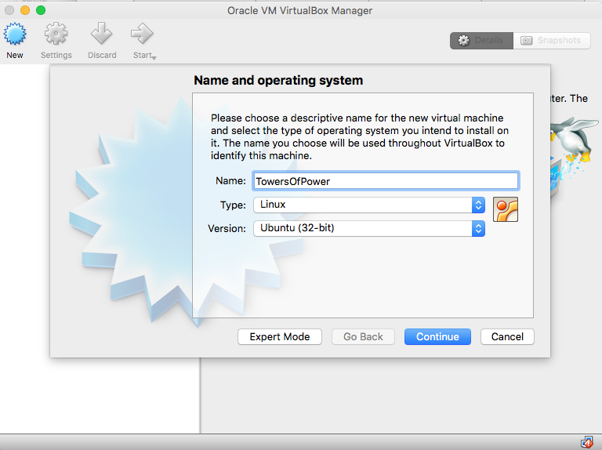
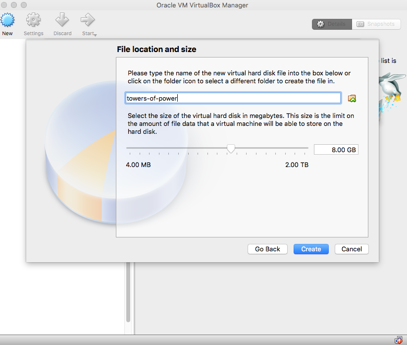
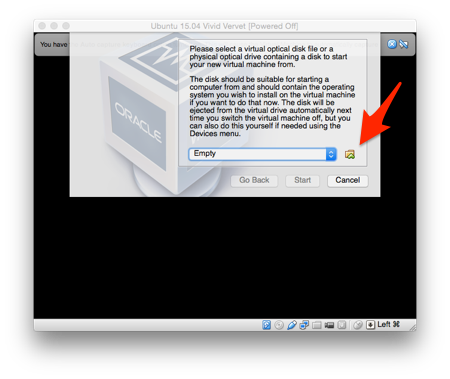

#VirtualBox
VM VirtualBox is free and open-source software developed by Oracle Corporation. It supports the creation and management of guest virtual machines. In other words it allows you to run other operating systems on your device. This is especially helpful when working with software that is best compatible with Linux, which is often true for the type of work we do.

It can be installed on a number of host operating systems, including: Linux, OS X, Windows, Solaris, etc.

This has been tested on OSX

1. Navigate to [Ubuntu download page](http://mirror.pnl.gov/releases/14.04.5) and download the ubuntu-14.04.4-desktop-amd64.iso. 
2. Now download and install [VirtualBox](https://www.virtualbox.org/wiki/Downloads)
3. When VirtualBox opens, click the New button.
4. Give your “virtual machine” a name. Set type to Linux and version to is Ubuntu (64 bit). Click Continue: 
5. Now decide how much memory (RAM) you’re going to allocate. The more memory you give to Ubuntu, the faster it will run. The drawback is that OS X will have less to use while Ubuntu is running. I used 2048.
6. On the Hard drive screen, select Create a virtual hard drive now and then click Create.
7. Next select select VDI (VirtualBox Disk Image)
8. Select Dynamically Allocated for Storage on physical hard drive.
9. Now give the “VirtualBox Disk Image” a name and determine the size you want to make the “hard drive” for Ubuntu. I selected 8GB – to allow for the install of a few programs and file storage. Click Create:  
10. Now start your brand new virtual box.
11. You’ll be prompted to locate the .ubuntu iso image you had downloaded earlier.  Do that: 
